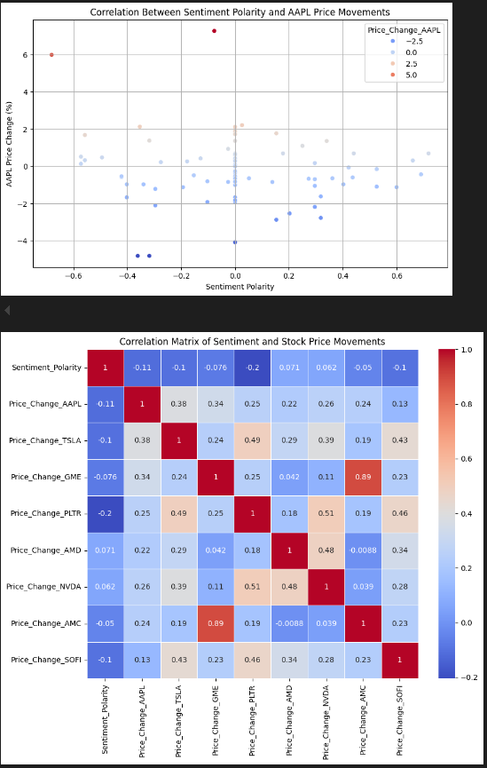
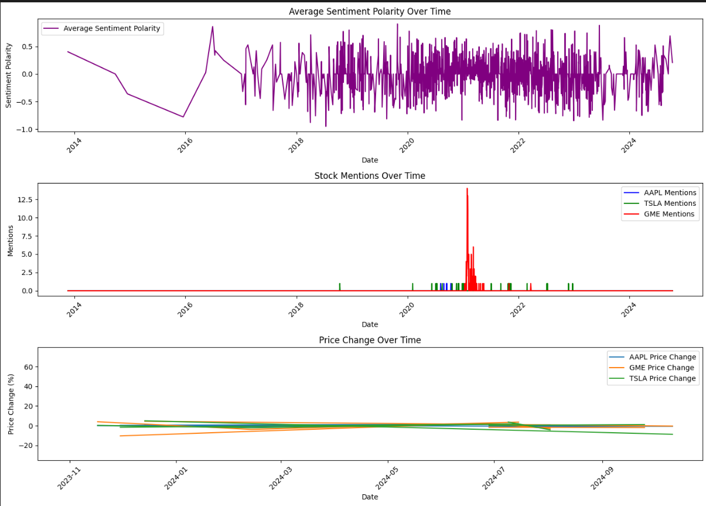

# Stock-Movement-Analysis-Based-on-Social-Media-Sentiment

## Introduction 
The Stock Movement Analysis project explores the relationship between social media sentiment and stock movements by analyzing Reddit data. Using the asyncpraw library for data scraping and vaderSentiment for sentiment analysis, the project uncovers insights into stock mentions and sentiment polarity, with potential integration of topic modeling using Latent Dirichlet Allocation (LDA) from scikit-learn.

## Technology Used 
1. Programming language - Python
2. Scrapping Tool - Asyncpraw library
3. Sentiment Analysis - VaderSentiment
4. Modeling - Latent Dirichlet Allocation (LDA)

## Some Useful Datasets After Transformation 
Reddit_Investing_Data - (https://github.com/Akash-8442/Stock-Movement-Analysis-Based-on-Social-Media-Sentiment/blob/main/reddit_investing_data.csv)

Reddit-Sentiment-Analysis- (https://github.com/Akash-8442/Stock-Movement-Analysis-Based-on-Social-Media-Sentiment/blob/main/reddit_sentiment_analysis.csv)

Reddit-correlation - (https://github.com/Akash-8442/Stock-Movement-Analysis-Based-on-Social-Media-Sentiment/blob/main/correlations_sentiment_stock_price.csv)

## Scripts for Project 
[Stock-Movement-Analysis IPYNB File] - (https://github.com/Akash-8442/Stock-Movement-Analysis-Based-on-Social-Media-Sentiment/blob/main/Stock_Movement_Analysis_Based_on_Social_Media_Sentiment%20(1).ipynb)

## Some Project Outcomes 

